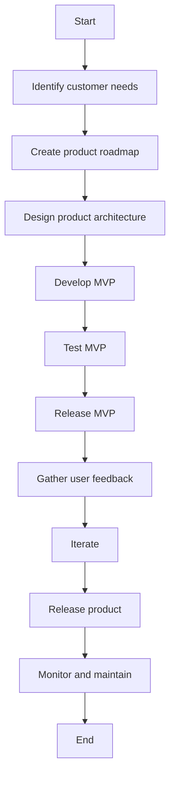

# Teaching-Timmsi-land-people-about--GitHub

```mermaid

graph TD;
    A[Start] --> B[Identify customer needs]
    B --> C[Create product roadmap]
    C --> D[Design product architecture]
    D --> E[Develop MVP]
    E --> F[Test MVP]
    F --> G[Release MVP]
    G --> H[Gather user feedback]
    H --> I[Iterate]
    I --> J[Release product]
    J --> K[Monitor and maintain]
    K --> L[End]

```
